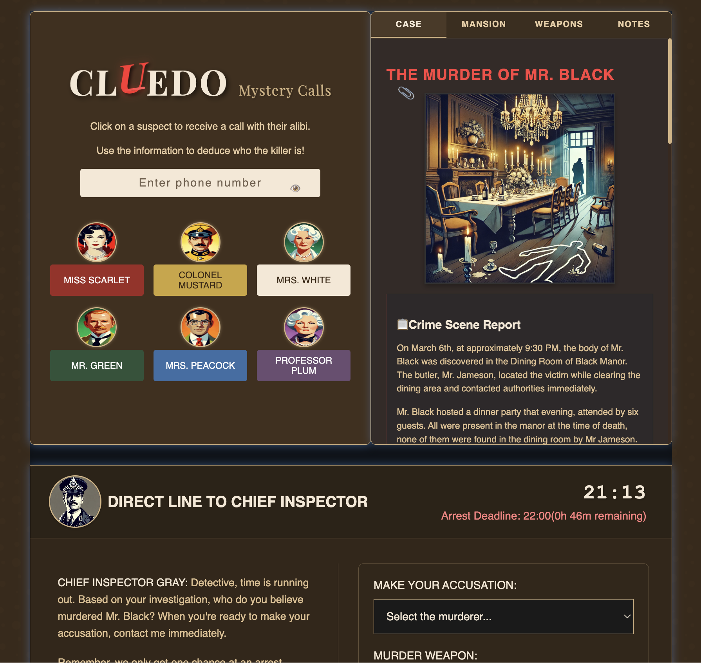

# 🕵️‍♀️ Cluedo Mystery Calls 🔍

> *"The game is afoot!"* - Call suspects, solve the murder, catch the killer!



## 🎭 What's This All About?

A modern twist on the classic Cluedo (Clue) board game that lets you **actually speak to the suspects on your phone** and interrogate them using AI voice technology! Play detective from your browser, make real phone calls to the suspects, analyze their alibis, and solve the murder case.

*Who killed Mr. Black in the Mansion with what weapon? Only your detective skills can solve this mystery!*

This was built during the BU C&I Research Week where students were working on Bland.AI projects. They had asked in previous hackathons for staff to have a go - so I did! I wanted to see how much I could build in a few nights with github co-pilot - quite a bit!

## ✨ Features

- 📱 **Real phone calls** to suspects using Bland.AI's voice technology
- 🎭 **Unique voices** for each Cluedo character (Miss Scarlet, Colonel Mustard, etc.)
- 🔎 **Interactive case files** with evidence, alibis, and notes
- 📝 **Call logs** to track your investigation
- 👮‍♀️ **Chief Inspector** debrief when you're ready to make an accusation
- 🕰️ **Real-time deadline** to add pressure to your investigation
- 🎨 Beautiful **noir detective aesthetic** with custom styling

## 🛠️ Built With

- 🔵 React + React Router (TypeScript)
- 🎨 TailwindCSS for styling
- 🗣️ Bland.AI API for voice calls
- 🏗️ Vite for fast development

## 🚀 Getting Started

### Prerequisites

- Node.js (v16+)
- npm or yarn
- A [Bland.AI](https://www.bland.ai) account and API key (and some credits)
- A verified phone number to receive calls

### 🔧 Installation

```bash
# Clone the repository
git clone https://github.com/yourusername/cluedo-mystery-calls.git

# Navigate to the project directory
cd cluedo-mystery-calls

# Install dependencies
npm install

# Rename the .env.example file to .env and update your API Key

"VITE_BLAND_API_KEY=your_api_key_here" > .env
```

### Environment Setup

1. Copy `.env.example` to `.env`
2. Add your Bland AI API key to `VITE_BLAND_AI_API_KEY`
3. If you're using your own Bland AI pathways, set `VITE_USE_PERSONAL_PATHWAYS=true`

### 🎮 Running the Game

```bash
# Start the development server
npm run dev
```

Your detective agency will open at `http://localhost:5173` 🕵️‍♂️

### 🔑 Setting Up Bland.AI

1. Create an account at [Bland.AI](https://www.bland.ai)
2. Add credit to your account - bland does give you some free to start with (calls cost ~$0.10-0.20 per minute)
3. Get your API key from your account dashboard
4. Create scenarios in Bland for each suspect (or use use instruction mode - see below)
5. Update the pathway_ids in the `blandAIConfig` file to match your Bland pathways for each suspect.

## Character AI Configuration

This game works in two modes:
- **Pathway Mode**: Uses pre-configured Bland AI pathways (requires specific pathway IDs)
- **Instruction Mode**: Uses character descriptions to guide the AI (works for everyone - but will be less fun!)

If you're cloning this repo, the game will automatically use Instruction Mode.

## 🎲 How to Play

1. Enter your phone number (this is where suspects will call you)
2. Click on a suspect to initiate a call
3. Answer your phone when it rings
4. Question the suspect about their alibi and movements
5. Take notes in the case file
6. Call more suspects to gather additional information
7. When ready, submit your accusation to the Chief Inspector
8. Explain your reasoning when the Chief calls you

## 💡 Tips for Detectives

- *"The best place to hide a clue is in plain sight!"* Look for inconsistencies in alibis
- Take detailed notes after each call
- Some suspects may lie to protect themselves
- Time is limited - use your calls wisely!

## 🧩 Project Structure

```
/app
  /routes
    home.tsx         # Main game interface
  app.css            # Styling
  /images            # Character portraits
```

## ⚠️ Disclaimer

This is an educational project demonstrating AI voice technology. Your phone number is only used to connect calls via Bland.AI and is not stored or used for any other purpose. All call data is processed by Bland.AI according to their privacy policy.

## 📝 License

This project is licensed under the MIT License - see the LICENSE file for details.

---

*"Elementary, my dear Watson!"* Happy sleuthing! 🕵️‍♀️🔍
